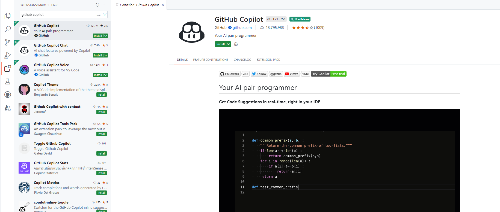
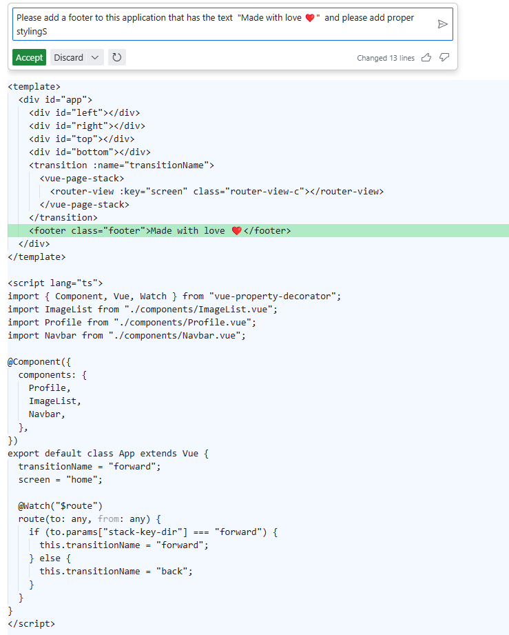
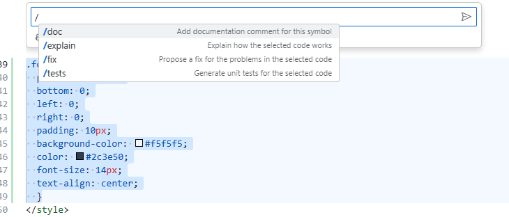

# 課題4: Github Copilot 

⏲️ _完了までの時間: 15 min._ ⏲️

## このパートで学ぶこと 🎯

- Github CopilotをCodeSpaceに追加します
- アプリケーションにフッターを追加します
- Github Copilotでコードを生成します
- Github Copilotでコードを説明します


## 目次

- [課題4: Github Copilot](#課題4-github-copilot)
  - [このパートで学ぶこと 🎯](#このパートで学ぶこと-)
  - [目次](#目次)
    - [参考になる情報](#参考になる情報)
  - [はじめましょう](#はじめましょう)
  - [フッターを追加します](#フッターを追加します)
  - [Github Copilotでコードを生成します](#github-copilotでコードを生成します)
  - [Github Copilotでコードを説明します](#github-copilotでコードを説明します)

### 参考になる情報

- [CSSとは?](https://developer.mozilla.org/en-US/docs/Web/CSS)
- [GitHub Copilot ドキュメント](https://docs.github.com/en/copilot)


## はじめましょう

この課題では、生成AIを使ったコーディングアシスタントである **「GitHub Copilot」** の機能を調査しながら、コーディングを行う流れを学びます。

私たちの目的は、このツールを使用して、フッターをアプリケーションに追加することです。Github CopilotをCodeSpace環境に統合することにより、プロセスを開始しましょう。

1. マーケットプレイスに移動し、GitHub Copilot拡張機能を検索します。
2. **[Install]** ボタンをクリックして、環境に追加します。

  

3. インストールを確認します。リポジトリ内のファイルを開き、コードの任意の場所で **Ctrl+I** を押します。Copilotがコードを生成するプロンプトが表示されたら、インストールが正常に完了しています！


## フッターを追加します

Webサイトのフッターは、Webページの下部にあるセクションのことです。

多くの場合、フッターには著作権に関する情報を追加します。私たちの目標は、このセクションをアプリケーションに組み込むことです。新しいブランチを作成して、このプロセスを開始しましょう。

1. GitHub Codespace環境内のターミナルで `git checkout -b add-footer` コマンドを実行します。このコマンドは、「add-footer」という名前の新しいブランチを作成し、この新しく作成されたブランチに自動的に切り替えます。
2. 次に、**frontend->src->App.vue** のファイルを開きます。

3.このファイル内で、</transition>閉じタグ(11行目)を見つけ、その下に次のコードスニペットを挿入します。

```html
<footer> with love❤️</footer>
```
この追加により、フッターセクションがアプリケーションに統合されます。

以前の課題で学んだことに従って、すべての機能が予想どおりに機能するように、CodeSpace環境内で変更内容を確認することが重要です。

1. ターミナルで、`cd frontend` コマンドを実行して、フロントエンドのディレクトリに変更します。
2. `npm run dev`を実行して、開発サーバーを起動します。
3. **Run in Browser** ボタンをクリックして、ブラウザでアプリケーションを起動します。ロードしたら、アプリケーションインターフェイスの下部までスクロールすると、新しく追加されたフッターが表示されるようになります。

```bash
cd frontend
npm run dev
```

現在のフッターには、GitHub Copilotで修正できそうないくつかの問題があります！


## Github Copilotでコードを生成します


フッターには視覚的なスタイリングがないことに気付いたかもしれません。スクロールバーをリリースすると、フッターがアプリケーションのメインセクションにすぐに消えてしまいます。

**カスケードスタイルシート(CSS)** は、レイアウト、色、フォントなどの要素を含むWebページの視覚的なプレゼンテーションを操作するために使用されるWeb開発の基本的な言語です。

次に、あなたがCSSを作成した経験がないが、それでもフッターの外観を強化し、スクロールバーの問題を修正したい開発者であると考えてみましょう。こんなとき、Github Copilot が役に立ちます！


1. 12行目で追加したコードの行を削除します 。
```html
<footer>Made with love ❤️</footer>
```


3. **[Ctrl] + [A]** を使用してすべてのコードを選択してから **[Ctrl] + [I]** を押し、プロンプトバーに以下を書き込みます。

```
このアプリケーションに「Made with love ❤️」というテキストがあるフッターを追加してください。そして適切なスタイリングを追加してください。
```

4. Copilotはコード提案を生成します。内容を確認して問題なければ **「Accept」**をクリックします。


  


5. ターミナルで `npm run dev` コマンドでアプリケーションを再実行し、ページをリロードすると、スタイリングのフッターが表示され、スクロールバーの問題が消えるはずです。


| :warning: 注意          |
|:---------------------------|
|Github Copilotは、参加者ごとに異なる結果を生成する可能性があります。ユーザーインターフェイスが写真に表示されているものとは異なるように見えるかもしれません。もし生成されたコードに問題がある場合は、コーチにお気軽にお問い合わせください。|


## Github Copilotでコードを説明します

Github Copilotは、コーディングだけでなく、なじみのないコードセクションを理解するための優れたツールとしても機能します。

その機能は、単純なコード生成を超えて拡張されています。バグの修正、コードドキュメントの生成、さらにはテスト作成を支援できます。

それでは、Github Copilotがコードを説明する方法を試してみましょう。


1.`.footer` スタイリングなど、確認したいコードのセクションを特定します。

2. **[Ctrl]+[I]**を押して、**/explain** と入力します。このアクションはほかにも、**/tests** / **/fix** / **/docs** などがあります。
   
3. **[Enter]** を押すと、左側のサイドバーにあるGithub Copilotのチャットセクションに説明が表示されます。このチャットインターフェイスを使用すると、プログラミング関連の質問であればCopilotと対話できます。ただし、新しいギターの購入場所など、プログラミング以外のトピックに関する情報は提供されません。

  


次のチャレンジに進む前に、GitHub Copilotといろいろ試してみてください。あなたにとって興味深いかもしれないコードのさまざまなセクションで調べてください。さまざまなコマンドを試して、Copilotの機能を活用して新しいコードスニペットを生成することを躊躇しないでください。変更を行うたびに、アプリケーションへの影響を観察するためにテストしてください。

