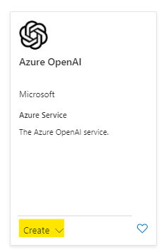
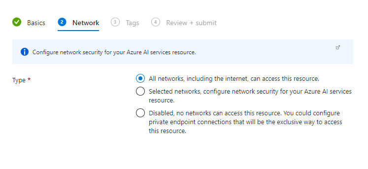

# 課題6: 生成AI Chat Bot

⏲️ _完了までの時間: 30 min._ ⏲️

## このパートで学ぶこと 🎯

- Azure OpenAI service を作成します
- OpenAIモデルをデプロイしてアプリに接続します
- GitHub Secrets を使用してAPIキーをアプリに渡します
- アプリで生成AIとのチャットを開始します

## 目次

- [課題6: 生成AI Chat Bot](#課題6-生成ai-chat-bot)
  - [このパートで学ぶこと 🎯](#このパートで学ぶこと-)
  - [目次](#目次)
    - [参考になる情報](#参考になる情報)
  - [はじめましょう](#はじめましょう)
  - [Openai Azure Service インスタンスを作成します](#openai-azure-service-インスタンスを作成します)
  - [OpenAIの大規模言語モデルのデプロイ](#openaiの大規模言語モデルのデプロイ)
  - [Azure OpenAI 資格情報](#azure-openai-資格情報)
    - [オプション1：OpenAI Azure資格情報をWebアプリに追加する](#オプション1openai-azure資格情報をwebアプリに追加する)
    - [オプション2：Azure OpenAIの資格情報をGitHub Secretに統合する](#オプション2azure-openaiの資格情報をgithub-secretに統合する)
  - [フロントエンドパイプラインを再実行します](#フロントエンドパイプラインを再実行します)

### 参考になる情報

- [Azure OpenAI ドキュメント](https://learn.microsoft.com/en-us/azure/ai-services/openai/)


## はじめましょう
- Azureポータルを開き、以前のチャレンジで作成したリソースグループに移動します。
- **Azure OpenAI** を検索し、新しいリソース作成します。
    


## Openai Azure Service インスタンスを作成します

-  **Azure AI services** を選択し、**Create** をクリックします。
- サブスクリプションとリソースグループは既に設定する必要があります。ここで、リージョンは **westeurope** にします。また、**Standard S0**を選択します。
- リソースにグローバルで一意の名前を付けます。
- **Next** をクリックして、ネットワークで「インターネットを含むすべてのネットワークがこのリソースにアクセスできる」を選択してください。
- **Next** をクリックしてリソースを作成します
  
  


## OpenAIの大規模言語モデルのデプロイ
- 作成したAzure openAI リソースに移動して、**Model deployments** をクリックします
- 次に、[Create new deployment]をクリックします。ここでは、展開するOpenAIモデルを選択します
  - モデル: **gpt-35-turbo** 
  - モデルバージョン: **Auto-update to default**
- デプロイ名に一意の名前を付けて、**`[create]`** をクリックします。この名前は後で使用します。

  

おめでとうございます！

これで、OpenAIのGPT3.5のモデル使ったチャットボットをMilligramアプリケーションに追加できました。

実際にAzure内でテストして、いくつかの質問をすることができます。

デプロイしたモデルに移動して、**Open in Playground** をクリックすると、チャットアシスタントとチャットできます。**Configuration > Parameters** の下でモデルのパラメーターを変更することもできます
 


## Azure OpenAI 資格情報

ユーザーインターフェイスをOpenAIモデルと接続するには、Azure OpenAIの資格情報を統合する必要があります。

このためには、2つのオプションがあります。
+ オプション1: Azure WebAppsにキーを追加
+ オプション2: GitHub Workflow にキーを追加

### オプション1：OpenAI Azure資格情報をWebアプリに追加する
Azureに戻り、MilligramのWebアプリをもう一度開きます。

-  **environment variables** に移動します。
- 変数 **CHAT_API_KEY** を作成し、Azure OpenAIのキーを貼り付けます。
- 変数 **CHAT_API_ENDPOINT** を作成し、Azure OpenAIのエンドポイントURLを貼り付けます。
- 最後に変数 **AZURE_OPENAI_MODEL_NAME** を作成し、Azure OpenAIで作成したモデルのデプロイ名を貼り付けます。


### オプション2：Azure OpenAIの資格情報をGitHub Secretに統合する

前の課題と同様に、GitHub Secretを追加します。

- Azure PortalからAzure OpenAIに作成したリソースを開きます。そして、**Keys and Endpoint**をクリックします。ここで、キーとエンドポイントをひかえます。
- 次にGitHubのリポジトリに移動します。**GitHub -> Settings -> Secrets -> Actions** に移動し、**`New repository secret`** を追加します。
   - Name: `CHAT_API_ENDPOINT`
   - Value: Azure AI servicesのエンドポイント
- シークレットを追加します。

- 続いてもう一度 **`New repository secret`** を追加します。
   - Name: `CHAT_API_KEY`
   - Value: Azure AI servicesのキー
- シークレットを追加します。
  
- さらにもう一度 **`New repository secret`** を追加します。
   - Name: `AZURE_OPENAI_MODEL_NAME`
   - Value: Azure AI servicesのモデル名
- シークレットを追加します。

そして、GitHubワークフローにシークレットを追加します。

1. **.github/workflows/main_milligram.yml** にあるファイルの74行目あたりにある `subscription-id` の下に次のコードスニペットを追加します。
   
```yaml
      - uses: azure/appservice-settings@v1
        with:
          app-name: 'ご自身のアプリ名'
          slot-name: 'Production'  # Optional and needed only if the settings have to be configured on the specific deployment slot
          app-settings-json: '[{ "name": "CHAT_API_KEY", "value": "${{ secrets.CHAT_API_KEY }}", "slotSetting": false }, { "name": "CHAT_API_ENDPOINT", "value":  "${{ secrets.CHAT_API_ENDPOINT }}", "slotSetting": false }, { "name": "AZURE_OPENAI_MODEL_NAME", "value": "${{ secrets.AZURE_OPENAI_MODEL_NAME }}", "slotSetting": false }]'
        id: settings
```

## フロントエンドパイプラインを再実行します

- **Actions -> Pages** を開き **Run workflow** に移動します。

パイプラインの下にデプロイステップの下に表示されるフロントエンドリンクをクリックします 。
`https://<ご自身のGitHubアカウント名>.github.io/...`
またはスマートフォンでアプリを開きます。

フロントエンドアプリケーションには、アシスタントとチャットできるチャットボタンが表示されます。アシスタントは、Azure OpenAI でデプロイした大規模言語モデルが動いています。ぜひ最新のAIとのチャットを楽しんでください🎉


