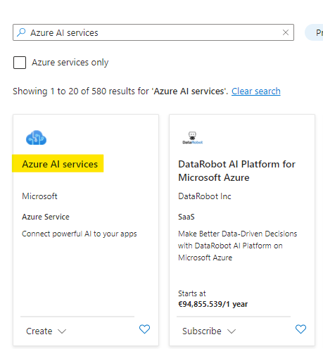
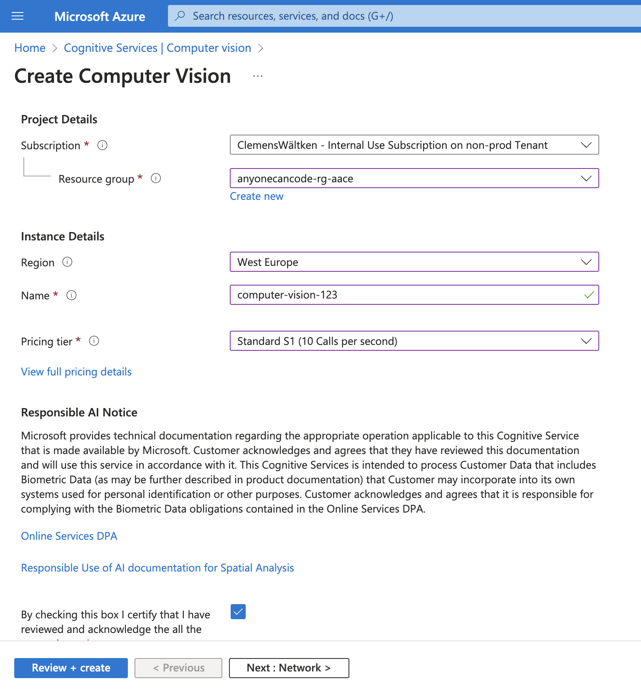
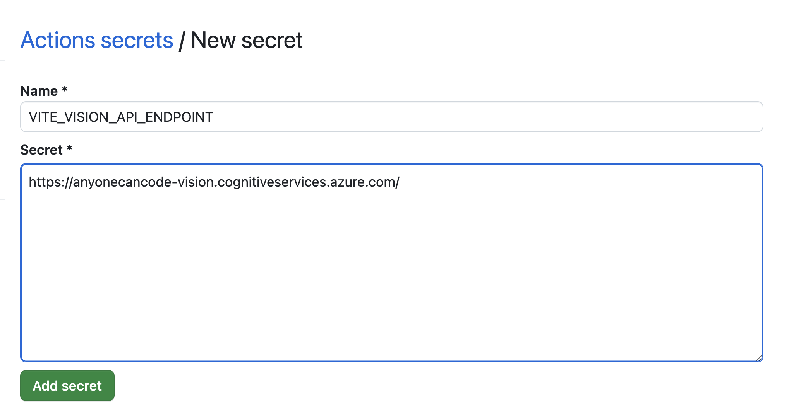
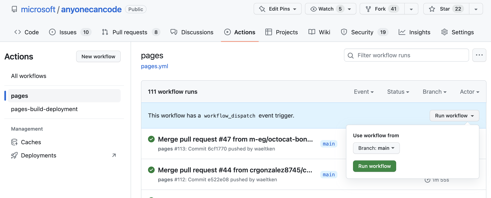

# 課題5:オブジェクト認識

⏲️ _完了までの時間: 30 min._ ⏲️

## このパートで学ぶこと 🎯

- Azure AI servicesを作成します
- Vision APIサービスをアプリと接続します
- GitHub Secrets を使用してAPIキーをアプリに渡します
- アプリでオブジェクト認識の機能が使えるのを確認します

## 目次

### 参考になる情報

- [ Resource / Resource Group / Subscription とは](https://docs.microsoft.com/azure/cloud-adoption-framework/govern/resource-consistency/resource-access-management)
- [Vision API](https://azure.microsoft.com/en-us/products/cognitive-services/vision-services/)
- [可用性ゾーンとは](https://docs.microsoft.com/azure/availability-zones/az-overview)
- [GitHub Encrypted secrets](https://docs.GitHub.com/en/actions/reference/encrypted-secrets)

## はじめましょう

- Azureポータルを開き、以前のチャレンジで作成したリソースグループに移動します。
- **Azure AI services** を検索し、新しいリソース作成します。
  
  

## Azure AI servicesを作成します

-  **Azure AI services** を選択し、**Create** をクリックします。
- サブスクリプションとリソースグループは既に設定する必要があります。ここで、リージョンは **westeurope** にします。また、**Standard S0**を選択します。
  ⚠️注意: westeuropeはハードコードされているので、このリソースは必ず **westeurope** で作成してください。
- リソースにグローバルで一意の名前を付けます。
- **Review + create** をクリックし内容に誤りが無いかを確認したうえで、**Create** をクリックしてリソースを作成します。
  
- リソースが作成された後、前回の課題と同様に、今回は **GitHub Secrets** に保存する **`Key`** と **`Endpoint`** をコピーします

## Azure AI servicesの資格情報をGithub Secretに統合します

Azure AI services を利用できるように、このリソースの情報をWebアプリと共有する必要があります。さらに2つのGithub Secretを作成し、これをアプリと共有します。

-  **GitHub -> Settings -> Secrets -> Actions** に移動し、**`New repository secret`** を追加します。
   - Name: `VITE_VISION_API_KEY`
   - Value: Azure AI servicesのキー
- シークレットを追加します。

-  **GitHub -> Settings -> Secrets -> Actions** に移動し、**`New repository secret`** を追加します。
   - Name: `VITE_VISION_API_ENDPOINT`
   - Value: Azure AI servicesのエンドポイント
- シークレットを追加します。

## フロントエンドパイプラインを再実行します

- **Actions -> Pages** を開き **Run workflow** に移動します。
  

パイプラインの下にデプロイステップの下に表示されるフロントエンドリンクをクリックします 。
`https://<ご自身のGitHubアカウント名>.github.io/...`
またはスマートフォンでアプリを開きます。

フロントエンドアプリケーションには、オブジェクト認識のための新しいボタンが表示されます。画像上のオブジェクトを検出し、画像上のオブジェクトを認識できるようにする必要があります。

※ この機能ではあなたが取った写真や検出されたものは保存されず、タイムラインやニュースフィードに表示されません。

## 試してみてください！あなたのアプリは何を検出できますか？

何枚か写真を撮り、アプリケーションが画像上のオブジェクトを検出できているかを確認しましょう。
その精度に驚かれるかもしれません😊

※ もしうまく動かなかったチームは サンプルのアプリケーション[Milligram](https://codeunicornmartha.github.io/FemaleAIAppInnovationEcosystem/#/?stack-key=a78e2b9a)で動作を見てください。

[◀ Previous challenge](../Github/README.md) | [🔼 Home](../../../README.md) | [Next challenge ▶](../../day2/Speech/README.md)
