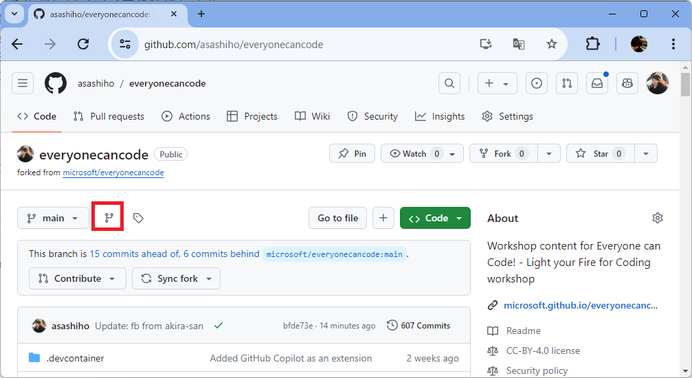
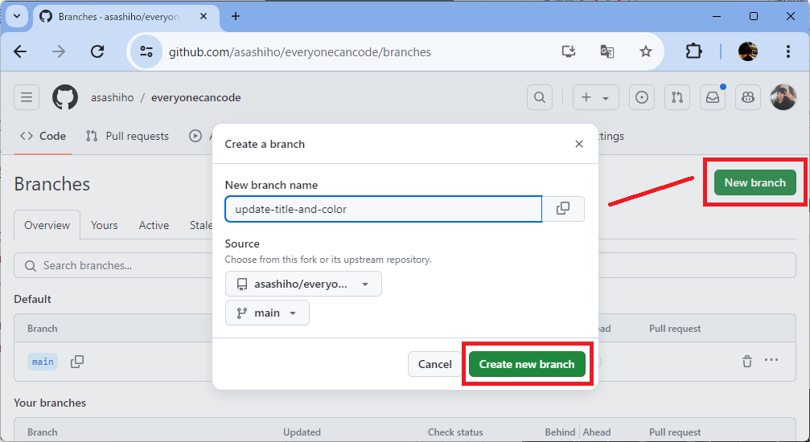
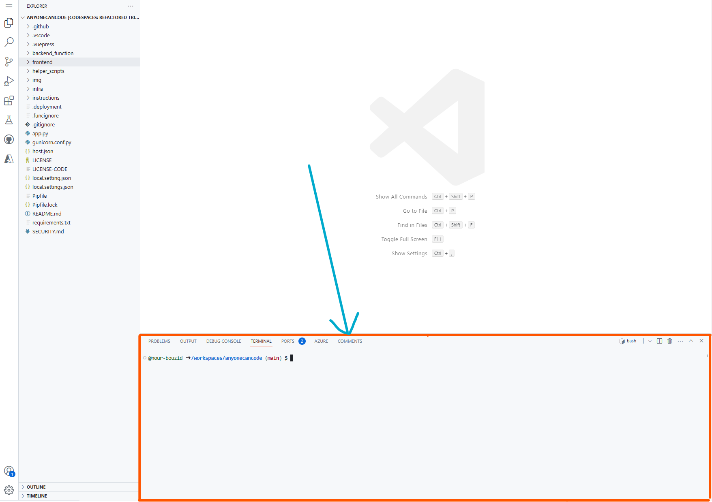
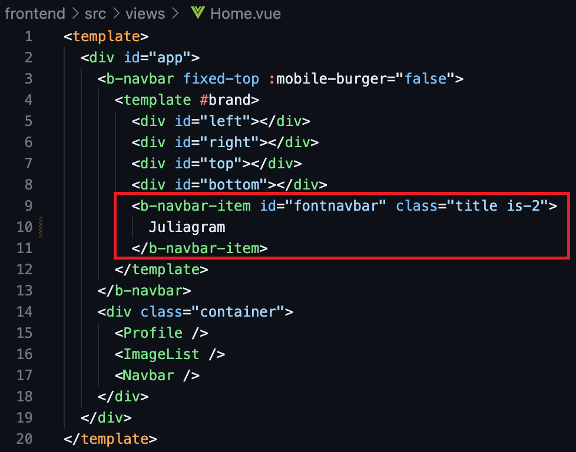
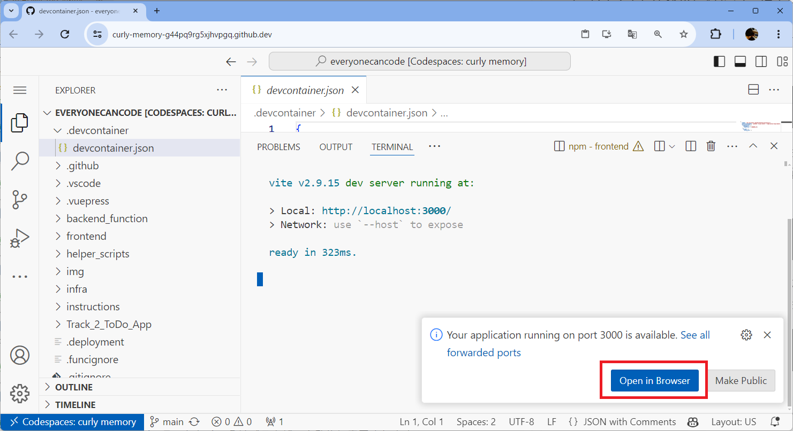

# 課題2：コードの変更とプルリクエストの作成とマージ


⏲️ _完了までの時間: 60 min._ ⏲️

## このパートで学ぶこと 🎯

- プロジェクトに新しいブランチを作成します
- タイトルを変更するためにコードを変更します
- Codespaceで変更を確認します
- 変更をコミットしてプッシュします
- プルリクエストを開き、マージします

## 目次

- [課題2：コードの変更とプルリクエストの作成とマージ](#課題2コードの変更とプルリクエストの作成とマージ)
  - [このパートで学ぶこと 🎯](#このパートで学ぶこと-)
  - [目次](#目次)
  - [プロジェクトに新しいブランチを作成します](#プロジェクトに新しいブランチを作成します)
  - [アプリのタイトルと色を変更します](#アプリのタイトルと色を変更します)
  - [CodeSpacesで変更した内容を確認します](#codespacesで変更した内容を確認します)
  - [変更をコミットしてプッシュします](#変更をコミットしてプッシュします)
  - [プルリクエストを作成し、マージします](#プルリクエストを作成しマージします)


## プロジェクトに新しいブランチを作成します

GitHubのリポジトリに移動します。**[main]** をクリックして、ブランチボタンをクリックします。


**[New Branch]** をクリックして、新しいブランチを作成します。
新しいブランチの名前 **「update-title-and-color」** を入力します。次に **[Create new branch]** をクリックしてブランチを作成します。



新しいブランチが作成されました。このブランチには、新しいタイトルと色を追加するための変更が含まれます。このブランチに切り替えるには、Codespaceのターミナルを使用します。ターミナルを開いて、
新しいブランチに切り替えるために、ターミナルに次のコマンドを入力します。

ターミナルにいくつかのGitコマンドを入力して、新しいブランチを作成しましょう。


<details>
<summary>ターミナルとはなんですか？</summary>

私たちはマウスを動かしてコンピューターを操作することに慣れています。

しかし、コンピューターを操作できる別の方法があります。それがターミナルです。マウスを使うする代わりに、ターミナルにコマンドを入力するとコンピューターを操作できます。

たとえば、コンピューターの特定のフォルダーに移動したい場合があります。そのときは、ターミナルに `cd <path-to-your-folder>` を入力します。

ほかにも数多くのコマンドがあります。すべてのコマンドのセットとその組み合わせをシェルスクリプト言語と呼びます。ターミナルで（写真に表示されているよう小さなボックス）に移動して`help` と入力すると、すべての組み込みコマンドが一覧表示されます。

自由にコマンドを試してみてください。よく使う一般的なコマンドは、`pwd` （現在のディレクトリのパスを出力する、pwdは印刷作業ディレクトリの略）や `ls`（現在のリポジトリ内のすべてのファイルをリスト）などがあります。

</details>

Codespaceのターミナルに次のコマンドを入力します。これは、リモートリポジトリから最新の変更を取得するコマンドです。

```bash
git pull
```

次に、ブランチを切り替えます。ブランチの名前が **「main」** から新しく作成した **「update-title-and-color」** に代わっていることを確認しましょう。

```bash
git checkout update-title-and-color
```


おめでとうございます！新しいブランチを作成し、正常に切り替えができました。これで、コードの修正を始められます！


## アプリのタイトルと色を変更します

Codespacesのエクスプローラービューで、フォルダー `frontend/src/views` にあるファイル `Home.vue` を開きます。このファイルにはホームビューの基本構造をきめる `<template>` があります。今はアプリ名が **「Milligram」** になっています。これをあなたが好きなタイトルに変更してみましょう。タイトルを変更するには、 `<b-navbar-item>` タグ間のテキストの文字を変更します。



色を変更するには、 `<b-navbar-item>` タグに新しい属性を追加する必要があります。属性は `style` と呼ばれ、タイトルを緑にしたいときは `color: green` を設定します。他の色を試したいときは[ここ](https://htmlcolorcodes.com/color-names/) から選んでください。

```html
    <b-navbar fixed-top :mobile-burger="false">
      <template #brand>
        <div id="left"></div>
        <div id="right"></div>
        <div id="top"></div>
        <div id="bottom"></div>
        <b-navbar-item id="fontnavbar" class="title is-2" style="color: green">
          Milligram <= ここに好きなアプリ名前を入れてください
        </b-navbar-item>
      </template>
    </b-navbar>
```

なお、GitHub CodespacesのUIにブラウザを使っている場合は、このアプリケーションのビルドツールであるViteのHMR(Hot Module Replacement)機能が原因で、ページの再読み込みが繰り返し起こる場合があります。解決するためには、`/frontend` の下にある設定ファイル`vite.config.js` と`package.json` を次の通り変更してください。なお、GitHub CodespacesのUIがVS Codeの場合、この問題はありません。

参考: [Issue: add config for websocket connection](https://github.com/vitejs/vite/pull/677)

+ `/frontend/vite.config.js` の変更箇所

```js
import { defineConfig } from "vite";
...

const codespaceName = process.env['CODESPACE_NAME'];
const codespaceDomain = process.env['GITHUB_CODESPACES_PORT_FORWARDING_DOMAIN'];
const hmrPort = 5173;

const hmrRemoteHost = codespaceName ? `${codespaceName}-${hmrPort}.${codespaceDomain}` : 'localhost';
const hmrRemotePort = codespaceName ? 443 : hmrPort;
const hmrRemoteProtocol = codespaceName ? 'wss' : 'ws';

....
export default defineConfig({
  server: {
    hmr: {
        protocol: hmrRemoteProtocol,
        host: hmrRemoteHost,
        port: hmrPort,
        clientPort: hmrRemotePort
    }
  },
  plugins: [vue()],
  resolve: {
  ....
  },
});
```

+ `/frontend/package.json` の変更箇所

```json
{
  "name": "milligram-frontend",
  "version": "0.1.0",
  "private": true,
  "scripts": {
    "dev": "vite --host 0.0.0.0 --port 5173",
    ....
  },
  "dependencies": {
  ....
  },
  "devDependencies": {
  ....
  }
}
```

もし不明なことがあれば、コーチに質問してください。


## CodeSpacesで変更した内容を確認します

1. プロンプトが表示されたら、推奨されている拡張機能をインストールします。
2. ターミナルで、`cd frontend` を入力し、フロントエンドフォルダーに移動します。

```bash
cd frontend
```

3. アプリケーションの実行にはさまざまなパッケージが必要です。`npm` コマンドを入力して、必要なパッケージをインストールします。

```bash
npm install
```

4. これで準備ができたので、次のコマンドを入力してこのコマンドを使用してアプリを実行します。

```bash
npm run dev
```

5. ポップアップが表示されたら、 **[Open in Browser]** をクリックしてください。ブラウザが開き変更した内容が表示されるはずです



6. 次に、タイトルの色を別の色に変更してみてください。ページを更新することなく、色はブラウザで自動的に変更されます！


::: warning トラブルシューティング 
もし **「open in browser」** ポップアップがウィンドウの下部に表示されない場合は、ページを更新して再試行してください
:::


## 変更をコミットしてプッシュします

ターミナルの右側にある **[+]** ボタンをクリックして、新しいターミナルを作成します。ここではアプリの実行を停止したくないため、新しいターミナルを使用してコマンドを実行していきましょう。


変更を確認した後、コミットしてプッシュする時が来ました。最初は、どのファイルを変更したかを確認したいと考えています。ターミナルに `git status` と入力し、**[Enter]** を押します。**home.vue** ファイルに変更があるため、変更されたとマークされていることがわかります。


最初に `git add` コマンドを実行します。これにより、すべての変更されたファイルがステージング領域に追加されます。

```bash
git add .
```

次に、コミットメッセージを作成します。コミットメッセージは`-m` フラグのあとに入力します。どのような変更を加えたかがわかるような内容をコミットメッセージを追加して、他の人があなたが変えたものを理解できるようにすることが重要です。たとえば、タイトルと色を変更した場合、次のようなコミットメッセージを追加します。


```bash
git commit -m "Update title and color"
```

その後、`git push` を実行して、GitHubに変更内容をプッシュします。

```bash
git push
```

実際にコマンドを入力すると、次のようになります。


これで準備が整いました。


## プルリクエストを作成し、マージします


次に、ブラウザでGitHubリポジトリに戻ります。**Compare & pull request** ボタンをクリックして、新しいプルリクエストを作成します。

::: warning
このメッセージが表示されない場合は、**Pull requests** タブをクリックし、**New pull request** ボタンをクリックします。
:::


新しいウィンドウが開きます。ここでは、最後のコミットメッセージをタイトルとして見ることができ、必要があれば説明を追加することもできます。次にマージをします。ここでは必ず、<span style="color: red; ">**ご自身でフォークした自分のリポジトリのメインブランチを選択** </span> していることを確認してください。

左下の **[Create pull request]**  ボタンをクリックして、新しいプルリクエストを作成します。


::: danger 重要！
以下のスクリーンショットに示すように、必ず自分がフォークしたリポジトリのメインブランチに対するプルリクエストになっていることを確認してください！
:::

別のウィンドウが開きます。ここでは、変更をもう一度確認できます。**[Files changed]** をクリックします。 **[Home.vue]** をみるとどこかどのように変更されているかを確認できます。


**[Conversation]** をクリックして、会話ビューを確認してください。ここでは、コミットメッセージと追加した説明を見ることができます。

プルリクエストは、コードの品質を確保するために、プロジェクトで他の開発者と一緒に作業するための良く利用されるやり方です。通常、別の人があなたの変更を確認し、問題ないことを確認したうえで、**main** ブランチに取り込みます。こうすることで、予期せぬバグや不具合が混入されるのを防ぎます。

私たちはこれを自分でやってみましょう！！

**[Merge pull request]** をクリックしてから、**[Confirm merge]** ボタンを確認して、変更をマージします。

すべてがうまくいった場合、プルリクエストがマージされたというメッセージが表示されます。


おめでとうございます！プロジェクトに最初の変更を行い、開発者がどのように協力してメインブランチに統合するのかの流れを学びました。
