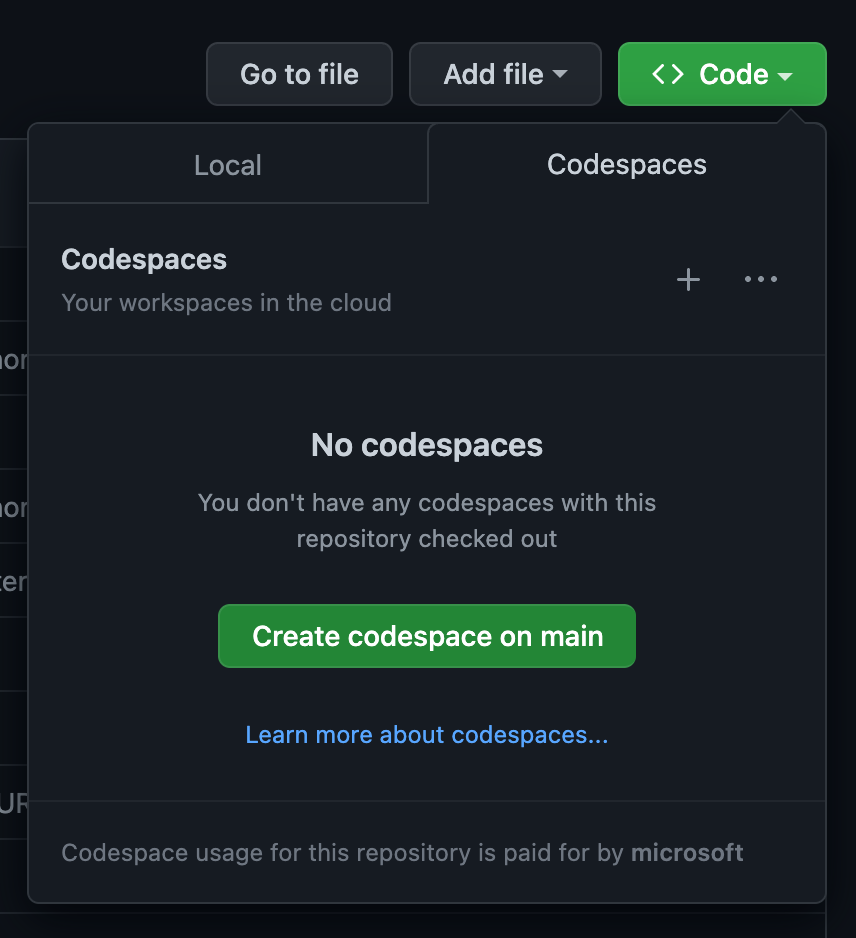

# 課題1: GitHub

⏲️ _完了までの時間: 45 min._ ⏲️

## このパートで学ぶこと 🎯

- GitHubのアカウントを作成する
- GitHubのプロフィールを編集して写真をアップロードする
- リポジトリをフォークする
- 応用：独自のGitHubキャラクターを作る

## 目次

- [課題1: GitHub](#課題1-github)
  - [このパートで学ぶこと 🎯](#このパートで学ぶこと-)
  - [目次](#目次)
  - [GitHubのアカウント作成](#githubのアカウント作成)
  - [GitHub プロフィールの編集](#github-プロフィールの編集)
    - [プロフィール写真をアップロードして、名前を入力します](#プロフィール写真をアップロードして名前を入力します)
  - [リポジトリのフォーク](#リポジトリのフォーク)
  - [GitHub Codespaces の作成](#github-codespaces-の作成)
  - [:cat: オリジナルのOctocatを作成しましょう](#cat-オリジナルのoctocatを作成しましょう)

## GitHubのアカウント作成

GitHubとは？

GitHub is  two things: **Git** and **Hub**.
GitHubを知る上での大事なポイント: **Git** と **Hub**

**Git** はバージョン制御ソフトウェアです。開発者は、変更を追跡することにより、特定のプロジェクトに同時に作業できるようになります。何か問題が発生した場合は、Gitで変更を簡単に元に戻すことができます。

**Hub** はそれ自体が特別なものではありませんが、Gitの上に構築された開発者の「ソーシャルネットワーク」を表しています。GitHubはGitソフトウェアを所有していませんが、Gitに簡単にアクセスしてコラボレーションできるプラットフォームを作成しました。GitHubの画期的な機能は、コードを世界と簡単に共有/表示するか、保管することが非常に簡単になることです。コードをどこに保存するかを心配する必要はもうありません。多くの企業はGitHubアカウントを持っています。GitHubは、ビルトインバージョンコントロールでオンラインでコードを簡単に保存する簡単な方法を提供します。

1.  [GitHub Webサイト](https://github.com/) に移動し、GitHubアカウントを作成します。
2. メールアドレス、パスワード、希望するユーザー名を追加します
  
  
3. 新製品の更新とアナウンスについてGitHubからメールを受信したいときは、 **「y」** そうでないときは **「n」** を入力します。
  
4. アカウントを確認するには、指示に従ってください。
  

これで、GitHubアカウントを正常に作成しました。次は、あなたのプロフィールを編集してあなた自身のものにしましょう。

## GitHub プロフィールの編集

### プロフィール写真をアップロードして、名前を入力します

これはあなたのアカウントのトップページです。この概要は、リポジトリへの貢献、独自のリポジトリ、成果など、GitHubでのアクティビティに関するすべてを示しています。

情報を変更または追加したいときは、右上隅の **[設定]** アイコンをクリックします。ここでもプロフィール写真をアップロードできます。

## リポジトリのフォーク

フォークとは、独自のGitHubアカウントのリポジトリのコピーを作ることです。元のプロジェクトに変更を加えずに自由に試したい場合に便利です。

さあ、このリポジトリをフォークしましょう！

## GitHub Codespaces の作成

GitHub Codespacesは、ブラウザから直接コーディングできるクラウドベースの開発環境です。また、ご自身のパソコンのVisual Studio Codeから接続することもできます。

フォークリポジトリで、**[<> Code]** と書かれた緑色のボタンをクリックして、**Codespaces** に移動し **[Create codespace on main]** をクリックします。

数秒後、新しいブラウザのウィンドウが開きます。右下隅には、このリポジトリに推奨される拡張機能をインストールするかどうかを尋ねるポップアップが表示されるので **[Install]** をクリックします。

GitHub Codespaces の別のタブを開き、Azure関数とPython用の拡張機能をインストールします。左上にある **[Explorer]** タブに戻ると、リポジトリのフォルダー構造を再度表示できます。

GitHubアカウントを正常に作成およびカスタマイズし、GitHub Codespacesを作成したので、次のチャレンジに進みましょう。

最初にコードを変更し、最初のプルリクエストを作成してマージします。

## :cat: オリジナルのOctocatを作成しましょう

Octocatは、GitHubの公式マスコットであり、かわいい猫のようなタコのようなユニークな生き物です。OctocatはGitHubコミュニティの愛されているシンボルになり、商品、イベント、ソーシャルメディアに現れます。

早めに終了した人たちのチャレンジ課題として、**[Octocat Builder](https://myoctocat.com)** を使用して、独自のOctocatをデザインしてみましょう。このツールを使用すると、Octocatの色、形状、アクセサリーをカスタマイズし、他の人と共有できます。

あなたのOctocatをあなたの個人的なアバター、あなたの分身と考えてください。ファンキーなヘアスタイル、クールな衣装、または風変わりなアクセサリーを試してください。

そして、あなたが作ったものをみんなに共有してください！
