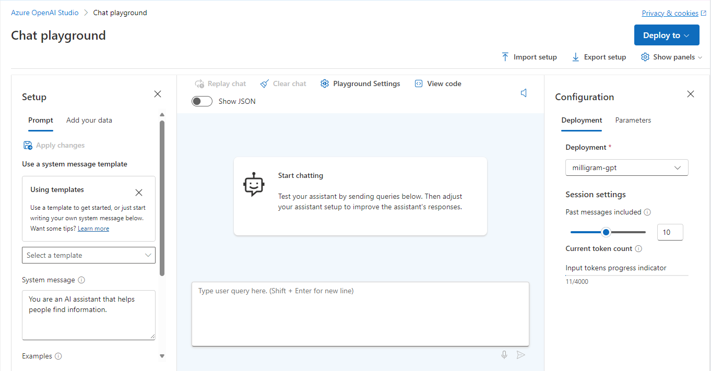
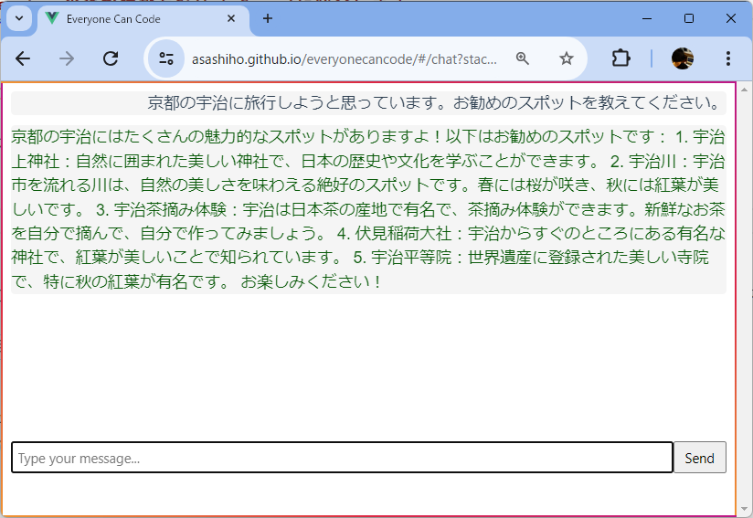

# 課題7: 生成AI Chat Bot

⏲️ _完了までの時間: 30 min._ ⏲️

## このパートで学ぶこと 🎯

- Azure OpenAI service を作成します
- OpenAIモデルをデプロイしてアプリに接続します
- GitHub Secrets を使用してAPIキーをアプリに渡します
- アプリで生成AIとのチャットを開始します

## 目次

- [課題7: 生成AI Chat Bot](#課題7-生成ai-chat-bot)
  - [このパートで学ぶこと 🎯](#このパートで学ぶこと-)
  - [目次](#目次)
    - [参考情報](#参考情報)
  - [Azure OpenAI Service インスタンスを作成します](#azure-openai-service-インスタンスを作成します)
  - [OpenAIの大規模言語モデルのデプロイ](#openaiの大規模言語モデルのデプロイ)
  - [Azure AI servicesの資格情報をGitHub Secretに統合します](#azure-ai-servicesの資格情報をgithub-secretに統合します)
  - [フロントエンドとバックエンドパイプラインを再実行します](#フロントエンドとバックエンドパイプラインを再実行します)


### 参考情報

- [Azure OpenAI ドキュメント](https://learn.microsoft.com/en-us/azure/ai-services/openai/)


## Azure OpenAI Service インスタンスを作成します

1. Azureポータルを開き、以前のチャレンジで作成したリソースグループに移動します。
   
2. **Azure OpenAI** を検索し、新しいリソース作成します。
   **「Azure AI services」** を選択し、**Create** をクリックして以下の値を登録します。

    

   - サブスクリプションとリソースグループを選択します。
   - リージョンは **westeurope** にします。また、**Standard S0**を選択します。
   - リソースにグローバルで一意の名前を付けます。
   - - **[Next]** をクリックして、ネットワークで **「インターネットを含むすべてのネットワークがこのリソースにアクセスできる」** を選択してください。
   - **[Next]** をクリックしてリソースを作成します
    
    


## OpenAIの大規模言語モデルのデプロイ
これで、Azure OpenAI Serviceのリソースが作成できたので、次は大規模言語モデルをデプロイします。

1. 作成したAzure openAI リソースに移動して、**[Model deployments]** をクリックします。
2. 次に、 **[Create new deployment]** をクリックします。ここでは、展開するOpenAIモデルを選択します。
   
   |設定項目|値|
   |-|-|
   | モデル| **gpt-35-turbo** | 
   | モデルバージョン| **Auto-update to default** |

3. デプロイ名に一意の名前を付けて、**[create]** をクリックします。この名前は後で使用するので、ひかえておいてください。

  


これで実際にAzure内で生成AIとのチャットを試すことができます。

デプロイしたモデルに移動して、**[Open in Playground]** をクリックすると、チャットアシスタントとチャットできるプレイグラウンドが表示されます。

**[Configuration] > [Parameters]** の下でトークン数などのモデルのパラメーターを変更することもできます。
 



## Azure AI servicesの資格情報をGitHub Secretに統合します

Milligramアプリケーションにチャット機能を追加するには、Azure AI servicesの資格情報を統合する必要があります。

<!-- このためには、2つのオプションがあります。
+ オプション1: Azure WebAppsにキーを追加
+ オプション2: GitHub Workflow にキーを追加 -->

<!-- ### オプション1：OpenAI Azure資格情報をWebアプリに追加する
Azureに戻り、MilligramのWebアプリをもう一度開きます。

-  **environment variables** に移動します。
- 変数 **CHAT_API_KEY** を作成し、Azure OpenAIのキーを貼り付けます。
- 変数 **CHAT_API_ENDPOINT** を作成し、Azure OpenAIのエンドポイントURLを貼り付けます。
- 最後に変数 **AZURE_OPENAI_MODEL_NAME** を作成し、Azure OpenAIで作成したモデルのデプロイ名を貼り付けます。


 -->

<!-- ### オプション2：Azure OpenAIの資格情報をGitHub Secretに統合する -->

前の課題と同様に、3つのGitHub Secretを追加します。

1. AzureポータルからAzure OpenAIに作成したリソースを開きます。そして、**Keys and Endpoint**をクリックします。ここで、キーとエンドポイントをひかえます。
  
2. 次にブラウザでGitHubのリポジトリを開きます。**[GitHub] -> [Settings] -> [Secrets] -> [Actions]** に移動し、**[New repository secret]** を追加します。

  次の３つのシークレットを追加します。

  |Name|Value|
  |-|-|
  |VITE_CHAT_API_KEY|Azure AI servicesのKey|
  |VITE_CHAT_API_ENDPOINT|Azure AI servicesのEndpoint|
  |VITE_AZURE_OPENAI_MODEL_NAME|Azure AI servicesのモデル名|


3. 次に、GitHubワークフローにシークレットを追加します。
   **.github/workflows/main_milligram.yml** にあるファイルの74行目あたりにある `subscription-id` の下に次のコードスニペットを追加します。
   
```yaml
      - uses: azure/appservice-settings@v1
        with:
          app-name: 'ご自身のWebAppsのアプリ名'
          slot-name: 'Production'  # Optional and needed only if the settings have to be configured on the specific deployment slot
          app-settings-json: '[{ "name": "CHAT_API_KEY", "value": "${{ secrets.VITE_CHAT_API_KEY }}", "slotSetting": false }, { "name": "CHAT_API_ENDPOINT", "value":  "${{ secrets.VITE_CHAT_API_ENDPOINT }}", "slotSetting": false }, { "name": "AZURE_OPENAI_MODEL_NAME", "value": "${{ secrets.VITE_AZURE_OPENAI_MODEL_NAME }}", "slotSetting": false }]'
        id: settings
```

## フロントエンドとバックエンドパイプラインを再実行します

登録したシークレットを追加するには、ビルドパイプラインを再度実行する必要があります。

- **[Actions] -> [Pages]** を開き **Run workflow** をクリックします。
- **[Actions] -> [Build and deploy Python app to Azure Web App]** を開き **Run workflow** をクリックします。


パイプラインの下にデプロイステップの下に表示されるフロントエンドのURLリンクをクリックするか、スマートフォンでアプリを更新します。

`https://<ご自身のGitHubアカウント名>.github.io/everyonecancode`




フロントエンドアプリケーションには、アシスタントとチャットできるチャットボタンが表示されます。チャットのアシスタントは、Azure OpenAI でデプロイした大規模言語モデルが動いています。ぜひ最新の生成AIとのチャットを楽しんでください:robot:
